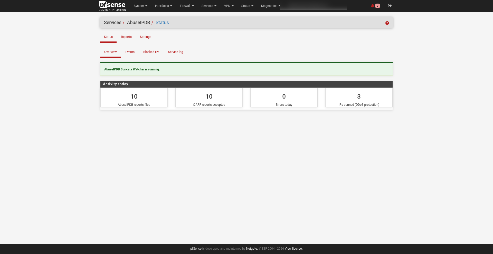
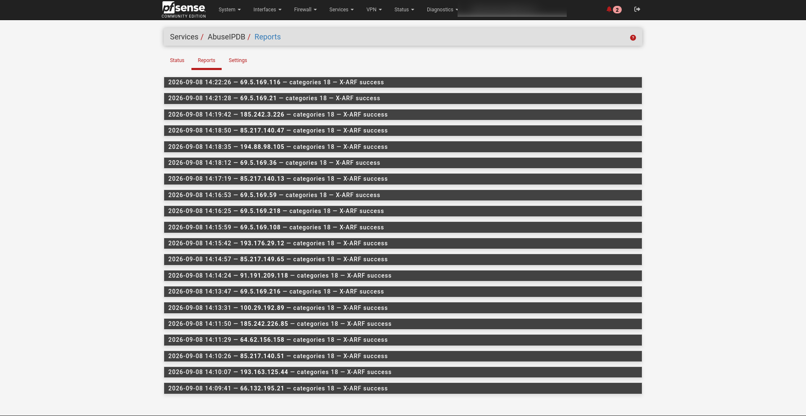
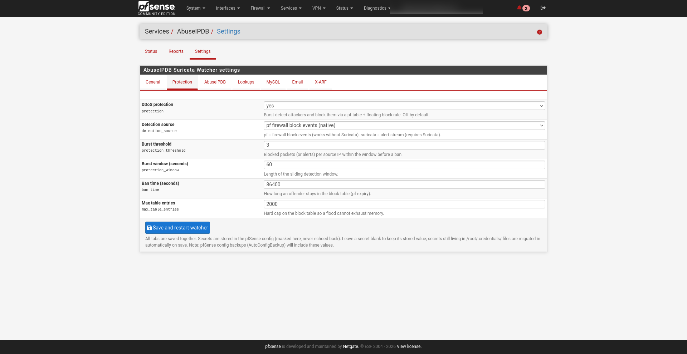
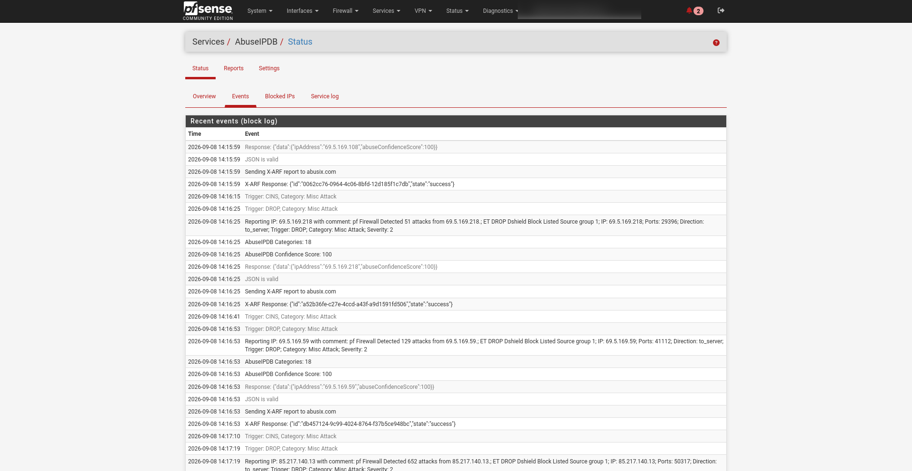
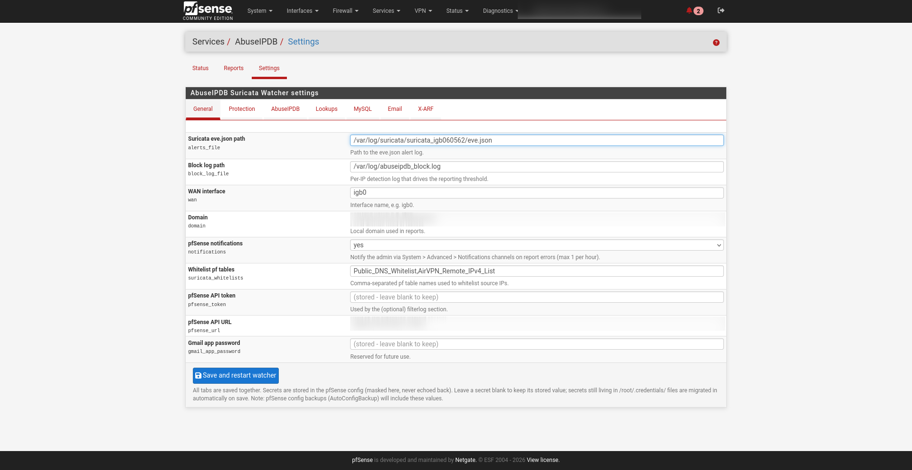
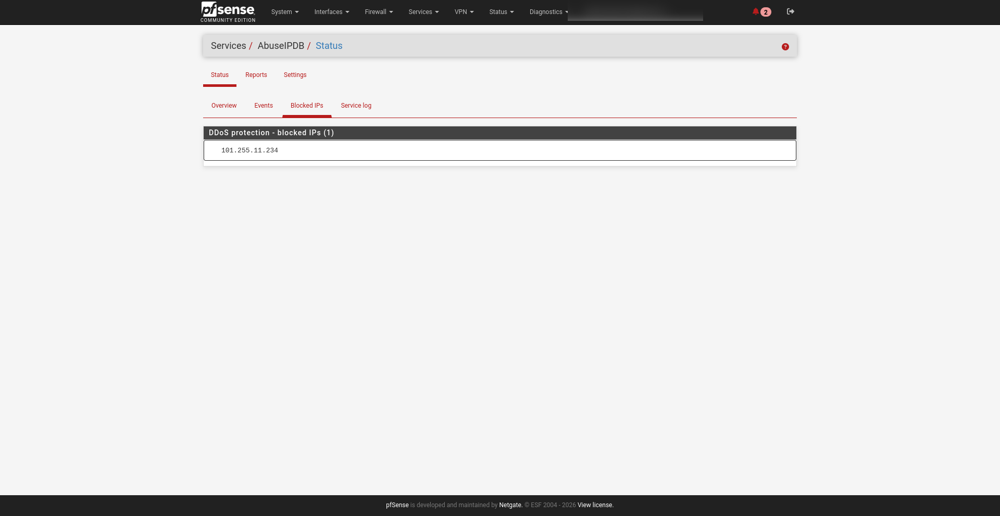
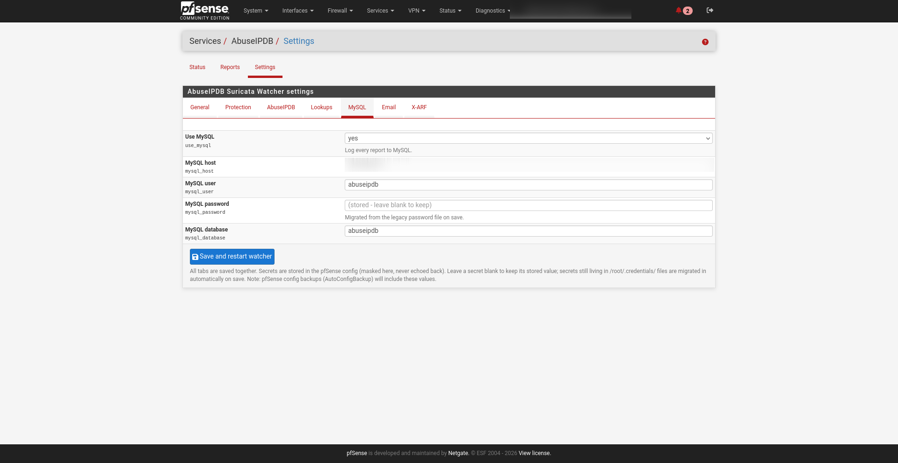
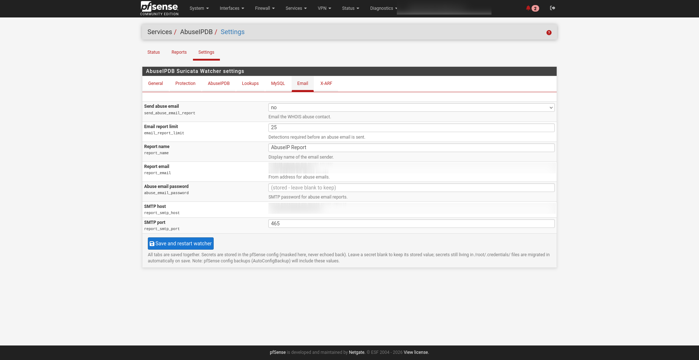
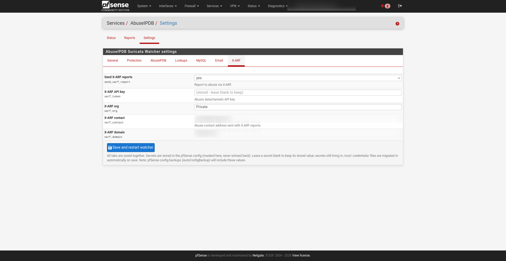

<h1 align="center">pfsense-abuseipdb</h1>

<p align="center">
  <a href="https://github.com/tmiland/pfsense-abuseipdb/releases"></a>
  
  
  <a href="LICENSE"></a>
  <a href="https://opencode.ai"></a>
</p>

<p align="center">
  Abuse reporting and DDoS protection for pfSense: reports attacker IPs to
  <a href="https://www.abuseipdb.com">AbuseIPDB</a>, files X-ARF reports with
  <a href="https://abusix.com">Abusix</a>, logs every report to MySQL, and
  auto-bans burst offenders via a pf table — all managed from a native web
  UI. Works with or without Suricata.
</p>

---

<p align="center">
  
</p>


**Full write-up on the blog:** https://tmiland.com/pfsense-abuseipdb/
## Features

- **DDoS protection engine** — burst-detects attackers from native pf firewall events (no Suricata required) or the Suricata alert stream, and bans them via a pf table with automatic expiry, whitelist awareness and a hard entry cap
- **AbuseIPDB reporting** — category-mapped reports with confidence-score gating, per-IP cooldown, and a credit link back to this project
- **X-ARF to Abusix** — structured abuse reports with alert evidence attached
- **MySQL logging** — every report stored for history and deduplication
- **GeoIP + WHOIS** — ipinfo.io lookup and WHOIS abuse-contact resolution, cached per IP
- **Native pfSense UI** — three pages under **Services → AbuseIPDB** (Status, Reports, Settings) with tabbed, theme-aware views for light and dark themes
- **pfSense notifications** — report errors and X-ARF failures alert you through the built-in notification channels (email/Telegram), throttled
- **Proper FreeBSD service** — rc.d script with crash-restart and log rotation
- **Installable package** — `pfSense-pkg-abuseipdb` from a hosted pkg repo

## Table of contents

- [Quick start](#quick-start)
- [How it works](#how-it-works)
- [Requirements](#requirements)
- [Configuration](#configuration)
- [Web UI](#web-ui)
- [Service management](#service-management)
- [Manual install](#manual-install)
- [Block log, cooldown and protection](#block-log-cooldown-and-protection)
- [Credits](#credits)
- [License](#license)

## Quick start

On the pfSense host — add the pkg repo and install:

```sh
cat > /usr/local/etc/pkg/repos/pfsense-abuseipdb.conf <<'EOF'
FreeBSD: { enabled: no }

pfsense-abuseipdb: {
  url: "https://tmiland.github.io/pfsense-abuseipdb/repo",
  mirror_type: "NONE",
  signature_type: "none",
  enabled: yes
}
EOF
pkg update -r pfsense-abuseipdb
pkg install -y -r pfsense-abuseipdb pfSense-pkg-abuseipdb
```

That's it — the watcher starts automatically and appears under
**Services → AbuseIPDB** in the web UI.

> pfSense pins the Package Manager *Available Packages* tab to the official
> Netgate repo, so third-party packages install from the CLI. Updates
> afterwards work with `pkg upgrade -r pfsense-abuseipdb`.

## How it works

Two engines run side by side as FreeBSD services:

**Reporting watcher** — tails the alert log, parses each alert safely
(comma-proof field parsing), resolves GeoIP + WHOIS abuse contacts (cached),
and once an IP has more than `report_limit` block-log entries, is outside
its `report_cooldown` window, and has AbuseIPDB confidence above the limit:
files a categorized report (comments carry a credit link and a log excerpt),
inserts into MySQL, optionally emails the WHOIS abuse contact, and sends an
X-ARF report with the evidence attached.

**Protection engine** — counts blocked packets (native pf `filter.log`) or
Suricata alerts per source IP in a sliding window. When an IP crosses
`protection_threshold` within `protection_window` seconds it is added to the
`abuseipdb_block` pf table (referenced by an auto-created floating WAN block
rule) for `ban_time` seconds. Whitelist tables, private/LAN addresses and
the WAN IP are never banned, and a hard cap keeps a flood from exhausting
memory.

## Requirements

Installed on pfSense (FreeBSD): `bash`, `jq`, `curl`, `whois`, `mysql`
client, `uuidgen`, `pfctl`. A MySQL/MariaDB server reachable from the
firewall with a `reports` table (for the MySQL logging feature).

Suricata is **optional**: the protection engine works on native pf firewall
events by default. Install/enable Suricata and set `detection_source=suricata`
for alert-based detection and reporting.

## Configuration

All settings live in `pfsense_abuseipdb.ini` next to the script (or edit
them in the web UI — values are stored in config.xml and the ini is
regenerated on save). If the ini is missing it is created from
`example_pfsense_abuseipdb.ini`.

Key groups: log paths and WAN interface, reporting thresholds
(`report_limit`, `abuseipdb_confidense_score_limit`, `report_cooldown`),
DDoS protection (`protection`, `detection_source`,
`protection_threshold`, `protection_window`, `ban_time`,
`max_table_entries`), notifications (`notifications`), MySQL connection
(`use_mysql`, host/user/database), abuse email settings, X-ARF settings,
and `suricata_whitelists` (comma-separated pf table names). See
[`example_pfsense_abuseipdb.ini`](example_pfsense_abuseipdb.ini) for every
key with comments.

### Secrets

Secrets (AbuseIPDB/ipinfo tokens, MySQL and SMTP passwords, Abusix key) are
entered in the **Settings** page (masked inputs, never echoed back) and
stored in the pfSense config. On save they are written into the package ini
(chmod 0600); empty secret fields keep their stored value, and secrets still
sitting in legacy `/root/.credentials/` files are migrated in automatically
— the package also migrates them on install/upgrade. The `*_file` ini keys
remain as a fallback read only when the value is empty.

> Heads-up: pfSense config backups (AutoConfigBackup) will include these
> values. If you prefer secrets to never leave the box, keep using the
> legacy credential files and leave the fields blank.

## Web UI

The package adds **Services → AbuseIPDB** to the pfSense menu with three
pages:

- **Status** — sub-views for Overview (service state plus clickable
  Activity-today counters for reports, X-ARF acceptances, errors and banned
  IPs), Events (filterable block-log events), Blocked IPs (live DDoS table)
  and the Service log tail (auto-refresh every 60 seconds)
- **Reports** — browse recent reports: each collapsible entry shows the full
  report comment (with the alert log excerpt) plus the AbuseIPDB and X-ARF
  API responses
- **Settings** — every ini key as a form field, grouped into tabs (General,
  Protection, AbuseIPDB, Lookups, MySQL, Email, X-ARF); saving regenerates
  the ini, restarts the engines and syncs the firewall alias/rule when
  protection settings change

All pages are theme-agnostic and follow the selected webGUI stylesheet —
including custom light/dark themes.

<p align="center">
  
  
</p>
<p align="center">
  
  
</p>
<p align="center">
  
  
  
</p>
<p align="center">
  
</p>

More views (service log, MySQL/Email/X-ARF details) live in
[`docs/screenshots/`](docs/screenshots).

## Service management

```sh
service pfsense_abuseipdb start    # also: stop, restart, status
sysrc pfsense_abuseipdb_enable=YES # start at boot
```

The service runs the reporting watcher and the protection engine (when
enabled) under `daemon(8)`: it restarts them if they die, reopens logs on
rotation, and both logs are rotated by newsyslog (1 MB, 3 generations).
`status`/`stop` find the processes via `pgrep -f`, since `daemon(8)`
retitles its process and its pidfile goes stale across restarts.

## Manual install

Without the package, deploy the pieces by hand (the package is recommended —
it also migrates an existing manual installation on install):

```sh
scp pfsense_abuseipdb.sh pfsense_abuseipdb.ini root@pfsense:/root/scripts/
scp pfsense_abuseipdb root@pfsense:/usr/local/etc/rc.d/pfsense_abuseipdb
```

```sh
./pfsense_abuseipdb.sh          # run the live watcher loop
./pfsense_abuseipdb.sh debug    # strict modes + tracing (still a live loop!)
```

> Even in debug mode the loop is live: it processes the newest alerts
> immediately and sends real reports.

## Block log, cooldown and protection

Every processed alert is appended to `/var/log/abuseipdb_block.log`; the
per-IP count in that file drives the reporting threshold. The cooldown uses
the same file: the timestamp of the last `Reporting IP:` entry for an IP is
compared against `report_cooldown` seconds (default 900 = 15 minutes,
AbuseIPDB's per-IP reporting limit). IPs inside the cooldown are skipped
before any API call.

The protection engine keeps its own state in
`/var/db/pfsense_abuseipdb_blocks.list` (IP + expiry) so bans survive
service restarts and are re-applied after a pfSense filter reload or reboot.
Every successful report is also recorded as JSON in
`/var/log/abuseipdb_reports.log` for the Reports page.

## Credits

Developed by [Tommy Miland](https://github.com/tmiland) with
[opencode](https://opencode.ai) — AI pair engineering behind the debugging,
the ini-based configuration, the rc.d services, the DDoS protection engine,
the pfSense package pipeline, and the web UI pages.

## License

[MIT](LICENSE)

---

Built with [opencode](https://opencode.ai/go?ref=00KNXXSB00) — the open-source
AI coding agent for the terminal. Grab your own at
[opencode.ai/go](https://opencode.ai/go?ref=00KNXXSB00).
